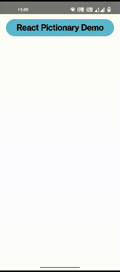

# React Native Pictionary Demo



### How to run

- Navigate to `backend` folder
- Open command prompt and install the dependencies
  ```
  npm install
  ```
- Start the backend server
  ```
  npm start
  ```
- Navigate to `react-native-pictionary` folder
- Open command prompt and install the dependencies
  ```
  npm install
  ```
- Run the app usig the following command
  ```
  npx react-native run-android
  ```
- [optional] Change the backend api `BASE_URL` from remote to the localhost for accessing the local sever
  ```
  const BASE_URL = "http://<local-machine-ip:3000>";
  const BASE_URL = "http://192.168.1.9:3000";  // provide your machine ip
  const BASE_URL = "https://react-pictionary-api-v1.herokuapp.com"; // remote hostname
  ```

### Code snippets

#### Backend 

```js
const express = require("express");
const fs = require("fs");
const app = express();
const port = process.env.PORT || 3000;

app.get("/", (req, res) => {
  res.status(200).json({ status: "running", message: "Server is up and running" });
});
app.get("/text", (req, res) => {
  let text = fs.readFileSync("./data/text.json");
  text = JSON.parse(text);
  res.status(200).json(text);
});
app.get("/keywords", (req, res) => {
  let keywords = fs.readFileSync("./data/keywords.json");
  keywords = JSON.parse(keywords);
  res.status(200).json(keywords);
});

app.listen(port, function() {
  console.log("App is running on port " + port);
});
```

#### Frontend

```js
import { View, ScrollView, Text, Image, ActivityIndicator, StyleSheet } from "react-native";
import React, { useEffect, useState } from "react";
import axios from "axios";
import ParsedText from "react-native-parsed-text";

const BASE_URL = "https://react-pictionary-api-v1.herokuapp.com";

export default function Pictionary() {
  const [textData, setTextData] = useState();
  const [keywordData, setKeywordData] = useState();
  const [keywordURI, setKeywordURI] = useState('');
  const [isLoaded, setIsLoaded] = useState(false);

  useEffect(() => {
    handleGetData();
  }, []);

  handleNamePress = async (keyword) => {
    await keywordData.filter(function (element) {
      if (("‎" + element.key.toString()) == keyword) 
        setKeywordURI(element.url);
    });
  };

  handleGetData = () => {
    axios.get(BASE_URL + "/keywords").then((response) => {
      let res = response.data;
      axios.get(BASE_URL + "/text").then((response) => {
        let resTexts = response.data.text;
        for (let i = 0; i < res.length; i++)
          resTexts = resTexts.split(res[i].key).join("‎" + res[i].key)
        setKeywordData(res);
        setTextData(resTexts);
        setIsLoaded(true);
      });
    });
  };

  return (
    <View style={styles.container}>
      <View style={styles.appBar}>
        <Text style={styles.appName}>React Pictionary Demo</Text>
      </View>
      {!isLoaded ? 
        <View style={styles.loader}>
          <ActivityIndicator size="large" color="#A8A4CE" />
        </View>
        :
        <View style={styles.bodyContainer}>
          <View style={styles.textContainer}>
            <ScrollView>
              <ParsedText
                style={styles.textStyle}
                parse={[
                  {
                    pattern: /‎(\w+)/,
                    style: styles.keywordStyle,
                    onPress: handleNamePress,
                  },
                ]}
              >
                {textData}
              </ParsedText>
            </ScrollView>
          </View>
          <View style={styles.pictureContainer}>
            {keywordURI === '' ?
              <Text style={styles.info}>Click on the highlighted words to see the corresponding image</Text>
              :
              <Image
                source={{ uri: keywordURI }}
                style={{ width: '100%', height: '100%', borderRadius: 30, }}
              />
            }
          </View>
        </View>
      }
    </View>
  );
}

const styles = StyleSheet.create({
  container: {
    display:'flex',
    width: '100%',
    height: '100%',
    alignItems: 'center',
  },
  appBar: {
    display:'flex',
    alignItems: 'center',
    justifyContent: 'center',
    padding: 10,
    width: '90%',
    borderRadius: 30,
    margin: 15,
    marginBottom: 10,
    backgroundColor: "#5BB7CF",
  },
  appName: {
    fontSize: 24,
    fontWeight:'bold'
  },
  bodyContainer: {
    display:'flex',
    width: '100%',
    height: '100%'
  },
  textContainer: {
    height: "50%",
    width: '90%',
    borderRadius: 30,
    padding: 15,
    margin: 15,
    marginTop: 0,
    backgroundColor: "#5BB7CF",
  },
  pictureContainer: {
    display:'flex',
    alignItems:'center',
    justifyContent:'center',
    height: '37%',
    width: '90%',
    borderRadius: 30,
    margin: 15,
    marginTop: 0,
    backgroundColor: "#5BB7CF",
  },
  textStyle: {
    textAlign: "justify",
    fontWeight: "bold",
    fontSize: 16,
    color: "#000",
  },
  keywordStyle: {
    fontWeight: "bold",
    fontSize: 16,
    color: "white",
  },
  loader: {
    minHeight: "100%",
    width: '100%',
    display: "flex",
    justifyContent: "center",
    alignItems: "center",
  },
  info: {
    display:'flex',
    textAlign: 'center',
    padding: 15,
    fontSize: 18,  
    borderRadius: 30,
    color: 'white'
  }
});
```